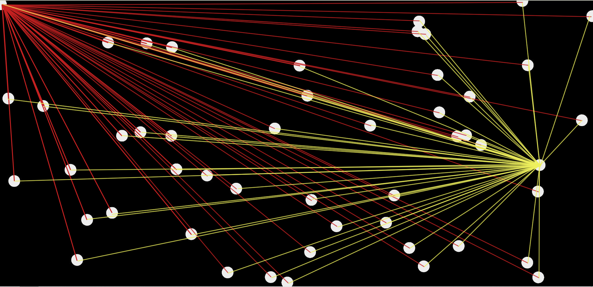
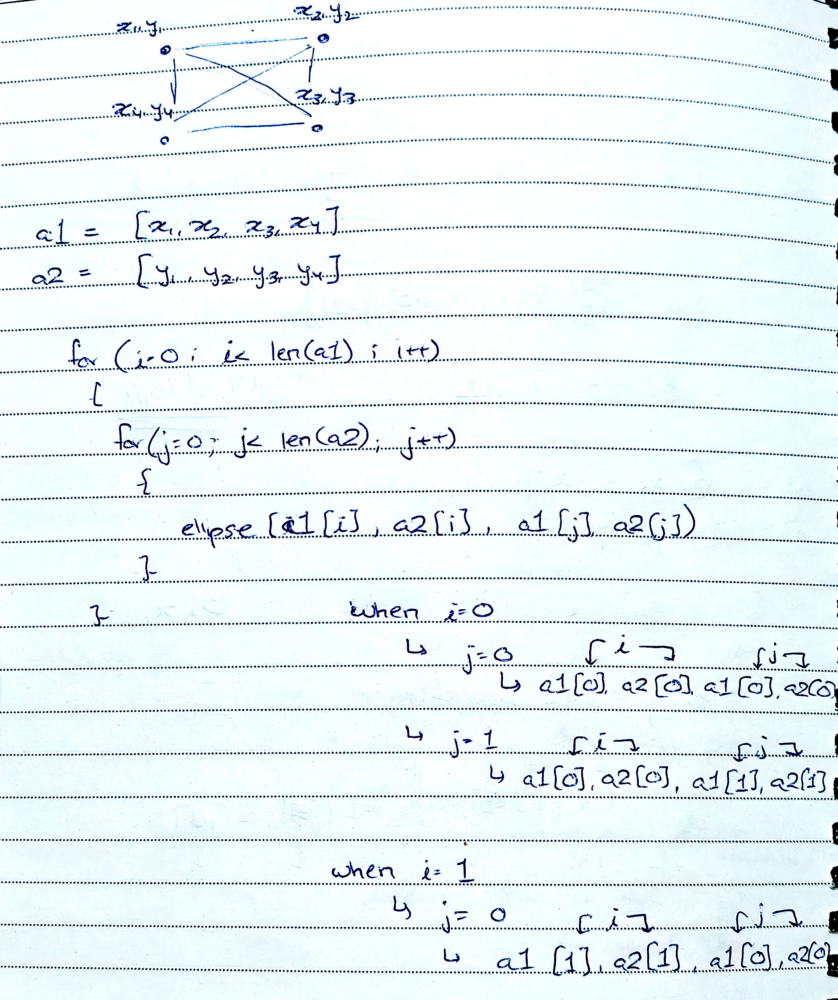

# ReadMe - HW03C Working Document

This exercise is expecting us to generate 50 circles spread evenly over the canvas, which are connected to each other by straight lines. For this exercise, I'm considering my canvas to be the viewport's width and height. My interpretation for this exercise is that every circle is connected to ***every other*** circle by a straight line, something like the below image:



The above image is my interpretation and ***not*** the actual generated image.

As this exercise entails experimenting with different no.of circles, I've created a mini-site for this exercise, with different pages for all the different quantity options.

I've created one variable for the circle quantity, and have initialized 2 empty arrays that'll be storing the circles' *x* and *y* coordinates, respectively.

```
for(let i=1;i<=maxCircles;i++)            //looping to generate 50 circles
  {
    xpos = int(random(width));              //generating random x-coordinate for circle, range is 0 to windowWidth-1
    ypos = int(random(height));             //generating random y-coordinate for circle, range is 0 to windowHeight-1  
    ellipse(xpos, ypos, dim);               //drawing circle
    circlePosX.push(xpos);                  //pushing coordinate into array for x-coordinates
    circlePosY.push(ypos);                  //pushing coordinate into array for y-coordinates
  }
```

1. *for* loop running for the number of circles.
2. generating random values for *xpos* and *ypos* of the circle
3. drawing circles using the generated values
4. pushing generated x-coordinate value into *circlePosX* array
5. pushing generated y-coordinate value into *circlePosY* array
<br>
<font size = 12px> Logic Used For Line Generation: </font>


1. Looping through both arrays
2. Generating lines joining the centers of circles

This was a really interesting exercise, and I had quite a lot of fun while figuring out the code for this.

The line-generation code took some time, as my loop was initially just generating 2 lines per circle. Realized that I was incrementing both *i* and *j* at the same time inside the loop, and had it rectified to produce the correct array indices.